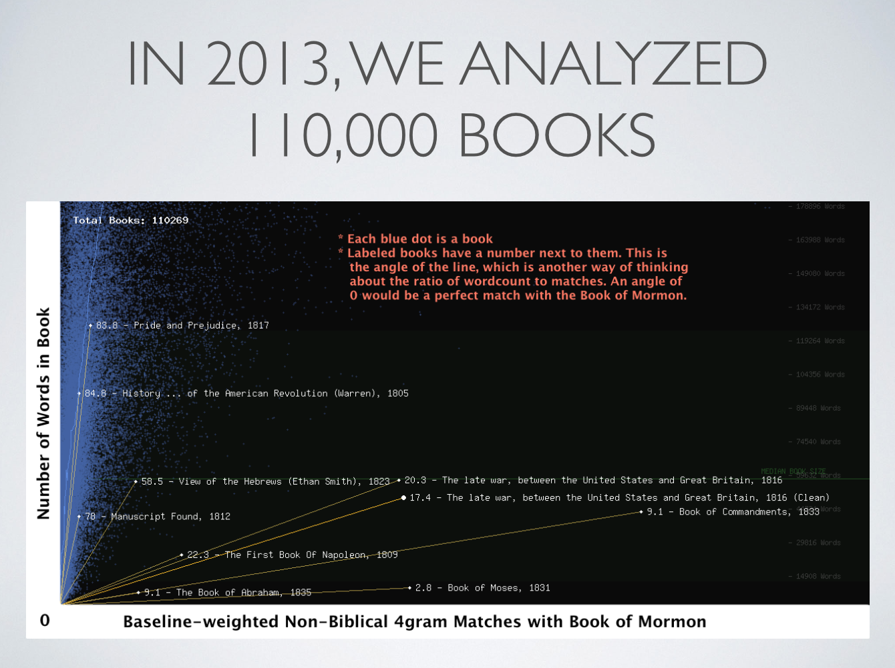
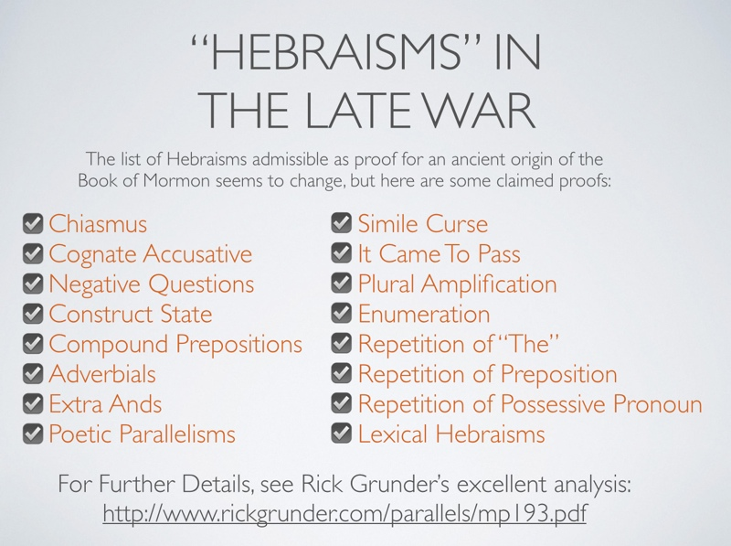

I gave a presentation to the Salt Lake City PostMormon group a couple of weeks ago summarizing some of the similarities between The Late War and the Book of Mormon, as well as further research we've made since our original work a little over a year ago.

For the complete Comparison we published online, please see http://wordtreefoundation.github.io/thelatewar/

The sound quality improves a little way in to the presentation.

<iframe width="560" height="315" src="https://www.youtube.com/embed/BccPmfR5oSs" frameborder="0" allow="autoplay; encrypted-media" allowfullscreen></iframe>

*Transcript Follows*

I'm curious how many people have seen the presentation that we gave at the Ex-Mormon conference about a year and a half ago? About a third, ok. So this is meant to be a primer, as well as to go a little bit more in depth in what we've seen since then.

So I want to explain a little bit about the motivation. The hypothesis--or at least the assumption--is, now that we know the Book of Mormon is a regular book, where did it come from? We think that some of what we've done shows evidence that could be further evidence that it's a regular book, but we aren't necessarily making the claim that this proves it's all made up--it's just more of a further exploration.

My perspective on the Book of Mormon is kind of like--or the feeling I have is--it's an old video game. Sometimes you want to go back and play the classics, bring it out for nostalgia. Sometimes you want to go a little bit further--you want to find out what's the actual Maximum High Score on this game, can I take it all the way. That's kind of what my brother, Chris, and I did.

We're using algorithms, and we put our geek on, and do some things to find out more information about this book. Because really, and I think many people share the same feeling here--you're kind of growing throughout your life in Mormonism, and then when you leave, the growth doesn't just stop, you want to keep growing. So this is part of my journey for growth.

What's really cool right now, is that the 19th century is being digitized. Everything that we know, everything that has been recorded, is being turned in to things that are searchable, indexable, computable. And it's happening for free. That's the starting point that we took when we began on this journey.

Archive.org is amazing: millions of books are available for free, you just have to download them, and they don't even have bandwidth caps, you can just keep downloading and downloading them. Google Books is similar--they're a little bit more proprietary in the way that they're doing it, some of their books aren't available as free texts, but you can at least search the books. And we have all of these universities that are collecting data and just scanning, like this, bringing books into the digital domain.

Chris's original talk was, "How the Book of Mormon Destroyed Mormonism," and what he means--and I'd like to put the context around that--what he means is that questions that can be turned into an algorithm are being coupled with knowledge that can be represented as data, and when the two collide, you get answers that have never been known before. Our ability to do these kinds of things is increasing exponentially--so even if The Late War is totally a wrong hypothesis (and I think we're still on to something), even if it's totally fake, we're still going to be able to continue pursuing new answers and new frontiers in Book of Mormon research that was never possible before.

This was our original study in 2013, we analyzed 110,000 books. Each of these blue dots, which you can barely see here, is a book. And what we have here is the number of words in the book. And then over here what we have is how many rare phrases matched with the Book of Mormon--and they were non-biblical. So what that means is we were ignoring things like, "And it came to pass" because that's a very common phrase--that doesn't actually uniquely match the Book of Mormon with anything else, because there are lots of books like that. But if you find something like "title of liberty," or something like that, that's much more rare, so you want to be able to weight those and increase the significance of those matches.

So what we found here--I think many people have seen this, if not, I'll just briefly go over this--anything that perfectly matches the book of mormon would basically be this line, it would be all the way down. So you can see the Book of Abraham is a pretty close match, the First Book of Napoleon is a pretty good match; Book of Moses--holy cow, it's pretty strange how Moses speaks like Joseph Smith--we also have The Late War, and The Book of Commandments over there, which is very similar. So those are the matches.

And this is The Late War. I'm just going to hand this around. This is a 200 year old book, so please treat it nicely. Feel free to open it, but don't crack it open all the way. I'm just going to pass it around and you can take a look at it. It was a very common book--Rick Grunder, this is from his personal collection--he has six of them. So it wasn't a particularly difficult to find book in the early 1800s--it was published in 1816. It was about the War of 1812.

I kind of really like this, because on my journey I've always wondered, why the heck does God want to talk about war all the time--it's just kind of like, I want more spiritual stuff--that's the way I was thinking, and we'd just sort of slog through Alma and stuff. We think that this matches significantly.

Here are some of the matches. I'm curious how many of you have seen this already? Again, about a third, maybe a little less. So these are some of the matches for The Late War and the Book of Mormon.

<table width="80%" align="center" class="comparison">
    <tbody><tr><th></th><th>The Late War</th><th>Book of Mormon</th></tr>
    <tr>
      <td width="10%">26:1</td>
      <td><b>the fourth day of</b> the <b class="c1">seventh month</b>, <b class="c2">which is</b> the birth day of Columbian Liberty and Independence,</td>
      <td><b>the fourth day of</b> this <b class="c1">seventh month</b>, <b class="c2">which is</b> in the tenth year of the reign of the judges.</td>
      <td width="10%">Alma 10:6</td>
    </tr>
  </tbody>
</table>

Both referring to periods of time when we switched from the rule of Kings to rule by vote--the rule of the people. The latter in the Book of Mormon isn't necessarily claiming that it's the first day, it's just related. It goes along with our hypothesis that maybe Joseph Smith read this book, and then some things were kind of ruminating, he had some ideas, and then he kind of remixed it, and he had a cool story.

Over here, near Moravian Town. Some LDS apologists have claimed that Moravian Town was not known until 1912 and so it was ridiculous for Joseph Smith to have known about that, and so how could he have made Morianton from that town. But here we have Moravian Town and Tecumseh in the same sequence as The Book of Mormon.

Here we have "two thousand hardy men, who fought freely for their country," they were "men of dauntless courage." Here we have "two thousand ... young men" they were "valiant for courage."

This is one of my favorites. If you think about Joseph Smith in his time, they just came to this--it's basically the equivalent of us going to Mars, right? People just moved over to this New World, it's totally fascinating, they don't know what to think of it--of course in the 1400s even moreso--but they're still exploring what this land is about. So they're still interested in explaining it to people. It's "plentiful," this land has "gold and silver," and "all manner of creatures that are used for food" (and in the Book of Mormon, they happened to be European creatures) but they also have the "mammoth" and the "elephant", which is an interesting idea. So, the elephant is not claimed to be in North America in The Late War, but it is in the Book of Mormon, which is an interesting connection. And also, we have cureloms and cumoms--I forget who it was, one of Joseph Smith's associates [Orson Pratt], claimed it was a mammoth. Interesting parallels there.

So here we have, "weapons of war," "great slaughter," "ditches surrounded"... so these are descriptions of battles, and in this particular case, it's centered around a fort, and it describes the same things in the same sequence. Here is digging trenches around these forts. So in the War of 1812, it was common practice, I mean they were building trenches to defend themselves from the British. This was military knowledge--this is what they were doing to prevent attacks.

So, there are many more here. I'm not sure how many I want to go over individually, but I just want to give context for how many rare matches there are in these two books. Very interesting. For me personally, another favorite that I have is the Liahona. It's not for certain that this is an exact match--but if it is a match, it sure is cool--because in The Late War, this "ball of curious workmanship" was a torpedo--it was basically the very beginning of timed warfare on the seas--so they would toss them out, and with a clock, blow it up at the right time, and it would destroy a ship. So we see here that we have "clock" and "spindles" and it's made out of "brass", "curious workmanship". I've always wondered, you know, why did God put that little ball next to the tent--why was it curious, and what was this thing? I always remember thinking, "what if we could go and get that technology? It would be so amazing! Because God made it!" So that's one of the things I think is cool.

This one, I'm going to go into further detail with, but this one is really amazing. And then, here we go, "borders of the land of Zarahemla", "borders of the land Columbia", they "gathered together," all these phrases are very similar. "Chief warriors" and "chief captains" laying their weapons "at the feet of" some special military leader. "People to rise up" one against another, their own families. "go with all our might against" a city. And this is the longest match that we found:

<table align="center" class="comparison">
  <tbody><tr><th></th><th>The Late War</th><th>Book of Mormon</th></tr>
  <tr>
    <td width="10%">34:10</td>
    <td><b>it came to pass</b>, <b class="c1">in the same year</b>, <b class="c2">that the people of <i>Columbia</i></b> were revenged of the evil:</td>
    <td><b>it came to pass</b> that <b class="c1">in the same year</b> <b class="c2">that the people of <i>Nephi</i></b> had peace restored unto them,</td>
    <td width="10%">Alma 50:37</td>
  </tr>
  </tbody>
</table>

These are all coming from http://wordtreefoundation.github.io/thelatewar/ so if you want to visit that, it goes into detail on all of those. Some people wonder, how much of the phrases are you skipping with the ellipses? Sometimes it's a lot, sometimes it's a little, so it is interesting to look at that more.

So here's one of them that I really like: the river battle. In The Late War, we have a battle raging "with great violence, and the men of Britain strove hard to pass over the river called Saranac" and I remember reading the Book of Mormon and thinking, is it a river? or is it waters? that's weird. I always wondered, why are we describing it in two different ways? Well, here we have a parallel: it's "the river called Saranac", and they're on "opposite side of the water", they "slew them with great slaughter", and they drove them back from crossing the bridges, and they were "slain", "so that the waters of the Saranac were dyed with the blood of the servants of the king." So all of the people went in to the river. And basically with the same language [in the Book of Mormon]: here we have "the guards of the king" instead of the "servants of the king", who "slew" them, drove them back and cleared the ground on "the west side" of the river instead of the "opposite side" of "the river Sidon", "throwing bodies of the Lamanites which had been slain, into the waters of Sidon, that thereby his people might have room to cross." Another thing that's kind of weird to me--it's kind of implicit here, but why did they need room to cross? It's a river, right? It's miles and miles, why can't you just kind of go around the people on the other side of the bank? Maybe there was a bridge? I don't know. Maybe some mental imagery prevented the author from thinking in terms of a wide river there.

Here's another one. This is a tower speech. This is nearing the end of the War of 1812. I don't know the exact month, but in The Late War, we have this man--Willet--who was giving a speech. He gets up on a podium (here we have the word, "rostrum") and talks to the people, gathered around--30,000 of them, gather around, and they "pitch their tents" from "the surrounding country" and they "assembled together" and they "gather themselves together" and this is a very old man, he's in his seventies, and "the people shouted with a loud voice," because of liberty and their country. He says that he's very old, and his "bodily infirmities"--if he didn't have these, he would keep fighting for his country. The same sort of things happen in Mosiah, for King Benjamin--"it came to pass that ... the people gathered themselves together throughout all the land, And ... they pitched their tents round about, every man according to hsi family ... for the multitude [was] great ... he caused a tower to be erected, that thereby his people might hear the words which he should speak ... [he caused them to] assemble yourselves together" and he is "about to go down to [his] grave." So we don't have those same words, but we have "bodily infirmities", "aged Willet", so there are some parallels but not exact words; and "they all cried with one voice," so I think it's interesting that there's this same dynamic between this person and the crowd, and they describe it in the same way.

So that's it for parallels right now. The strongest argument that The Late War has is that "Hebraisms" in the Book of Mormon, don't really offer evidence for it being ancient, because all of these "Hebraisms" are also found in The Late War. Chiasmus, Cognate Accusative, Negative Questions, Construct State... Rick Grunder has put together an analysis of almost all of these (I added a few from other sources) and described what they are. I kind of feel bad a little bit, because I know there are some linguists who are defending the Book of Mormon, and they have some really awesome knowledge from their domain, and they've put it in to defending the Book of Mormon, but they just didn't look around enough to see the context. So really, that's not good evidence.

So this is the method that we used. I want to just describe this briefly. It's fairly simple math, so I'll just go over it briefly. This is how we score a document: in this case we're looking at bigrams, so that means "two words," so we take a two-word sequence like "I Nephi" and we say "how many times does 'I Nephi' appear in 100,000 documents, or 50,000 documents?" And here's [the number one for] once, i.e. in the Book of Mormon. If we were to find something that said "I Nephi," it would be a super-mega-match, it would be like "Holy Cow! We found something awesome!" but we didn't--there are no "I Nephis" anywhere else. "Nephi, having" same thing, but "having been" shows up in a lot of documents. So 10,000. "been born", a little rarer than this, but not terribly rare. Same with "born of". But "of goodly" turns out to be somewhat rare, and "goodly parents" turns out to be quite rare--as rare as "I Nephi" in our dataset. So we take the inverse of each of them, and we get 3.04. So as you can see here, the score for this document--basically what we're doing here is scoring "how many rare words there are"--it's not very useful yet. That score is 3 because "I Nephi", "Nephi having" and "goodly parents" are rare. The rest of them are almost insignificant.

What we want to do is find the matching rare words, right? So here's something I found: Jonathan Swift says, "My birth was of the lower sort, having been born of plain and honest parents." What we want to do is see what's the score, or what's the match--how valuable is this match--in assessing whether there's a connection between these two. There's no "I Nephi" in there--that would be awesome if we did, we didn't find it, so it doesn't count. But, "having been" is there, so that shows up here; "been born" is here; "born of" shows up, and "parents" shows up. So, we add up all those numbers, we get 0.005. So this is not a significant find.

I guess I should explain a little bit more. What we did in the study is we found significant finds, right? We found words that are rare. Phrases of 4 or more matches that match other documents and were not found anywhere else. So those are what we mean by rare matches.

Q: How high does the number have to be for you to consider it significant?

A: In our original study, if it was found in 5 or more documents, then it wasn't really significant to us. I guess that's not entirely true--it's just the math, right? If it shows up in one other document, then it's rare--it's going to be a "one over two", so the "two" would be the Book of Mormon and one other book.

Q: So a point five would be significant?

A: Yeah, that would definitely be. It's not like each individual match is significant, but when you add up signficant ones like that, then you get a higher score, and that's what happened with The Late War and The First Book of Napoleon.

So, continuing on. That's basically our first study. What we found though, is kind of interesting. The Late War is one book in a genre. It's something that's been studied by Eran Shalev--he wrote a book called American Zion--and he's a professor (non-LDS) at the history department at Haifa, Israel. He studied American texts that were written like the bible, and The Late War falls in this genre. So does the Book of Mormon. This whole genre is really an interesting genre, because it tells us a lot about the early American ideas that were happening. There were a couple of things happening--one was America was reading a book that it considered Holy, that had nothing to do with them--like, Israel, the Holy Land, is far away. The promised land, the chosen people--all of this stuff is really nothing to do with them. But they're forming an identity, right? They're America. They're trying to create a story about themselves, and they cherish this book, so they created stories around the bible that related to America. They basically biblicized themselves--they created a story about how they are biblical. And you'll get tons of stories about how America *is* the Chosen Land, that they are the chosen people, and they'll talk about the similarities between the Exodus and themselves leaving Britain. So the Book of Mormon in that sense is not unique at all--it was very much a part of this zeitgeist.

So these are some of the books that we've since discovered and we've actually turned them into digital documents. These are a little bit harder to find, that's why we didn't have them in our original study. Many of them didn't exist in archive.org's stuff, and many of them, if they did at all, were very messy. When you do OCR, scans of documents, they end up with mistakes and it's usually only about an 80% accuracy rate. And so it takes a lot of manual work to get these going. So this is the new set, and we could definitely use help in finding, identifying, or improving the scope and quality of documents that we have. We've made them publicly available here, so anyone can download them, study them, compute with them. Many of them are quite small. Our algorithm doesn't really work with small texts. The problem with small texts is that the uncertainty increases. So if we find a match in a small text, it could mean something, but it also really might not mean something. Since that's the case, we've had to prune the ones that aren't very big.

So this is a preliminary result. We kind of wanted to look at the set of documents we have now, and what are the relationships that we see in them? The size of the circles is the size of the books. The width of the line is the relative strength of the connection. So you can see that The Late War was definitely inspired by The American Revolution which was written 14 years before. But the other ones, it's not as clear. There are a lot of similar numbers. It's not really clear yet, from this particular algorithm, if there's a really strong connection. We do have some exciting things that are coming, but we don't really have results to share right now. One of the things that we've really wanted to do, and that we've found a method to do, is studying synonyms. If you look at sentences and find similar words in the same sequence, if you find long matches of sequences, that's also a very strong signal. We couldn't do that with this study, because our ability to tell what was synonymous was limited. But there's been some really cool research in vectorization of words, so you can take a word and translate it into a large dimensional space, and relate their meanings to one another now. It's all open source, and it's all available, so we're going to do that next.

We have a little group--WordTree Foundation--we have a google group and a github account, where we contribute code and things like that. If any of you are interested, there are lots of interesting things to be done. We aren't particularly--we're kind of a loose-knit group, so it's not like "if you join us you have to go do this." It's more of, "What's your interest?" Maybe we have resources. Maybe someone is interested and they can do it with you. It's a collective. We have about 20 members right now. So that's what we're doing next, and that's where we are so far. Thank you.

[Q&A]

